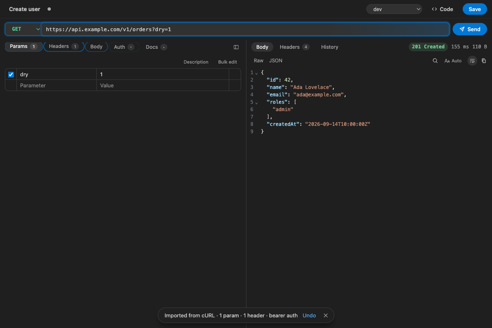
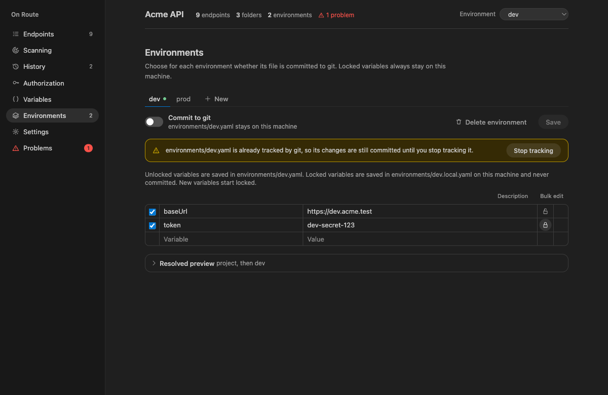
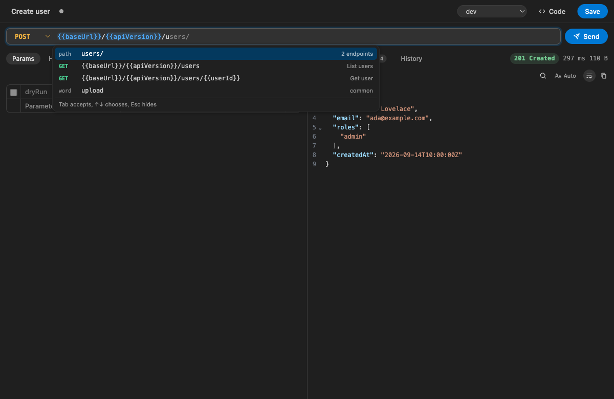
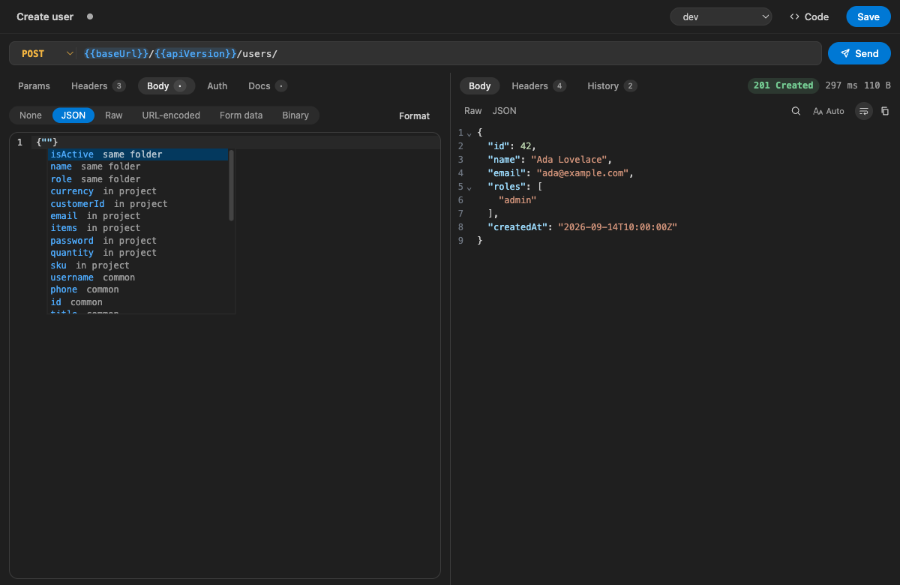

<p align="center">
  
</p>

<h1 align="center">On Route</h1>

<p align="center">
  <b>The git-friendly API client for VS Code.</b><br>
  Every request is a YAML file in your repo — reviewed, diffed and shared like code.
</p>

<p align="center">
  <a href="https://marketplace.visualstudio.com/items?itemName=on-route.on-route"></a>
  <a href="https://marketplace.visualstudio.com/items?itemName=on-route.on-route"></a>
  <a href="LICENSE"></a>
</p>

<p align="center">
  
</p>

---

## Why On Route?

API clients usually keep your collections in a cloud account or a single giant export file. On Route keeps them **next to your code**:

- 📁 **One YAML file per request** under `.on_route/` — folders are directories.
- 🔍 **Scans your server code** and creates a request for every route it finds.
- 🔀 **Git is the sync layer** — branch, review and merge API changes with the code that introduced them.
- 🔒 **Secrets never leave your machine** — locked variables live in gitignored `*.local.yaml` files.

No account. No cloud. No lock-in.

## Features

### ⚡ Requests
- HTTP (`GET`, `POST`, `PUT`, `PATCH`, `DELETE`, `HEAD`, `OPTIONS`) and **WebSocket** connections.
- Params, headers, body (JSON, raw, URL-encoded, form data, binary), auth and docs per request.
- Response viewer with JSON formatting, search, images, audio, video and PDF previews, and download.
- **Response history** — the last 20 responses per request, kept in a gitignored `.history/` folder.
- **Undo / redo everywhere** — `Cmd/Ctrl+Z` works across URL, params, headers, body, auth and docs, even after auto save.

### 🛰️ Endpoint scanning
Reads your server code and adds every route as a request, one folder per router. Supports:

| Language | Frameworks |
|---|---|
| JavaScript / TypeScript | Express, Fastify, Hono, Koa, Elysia, NestJS, Next.js |
| Python | FastAPI, Flask, Django (incl. DRF) |
| Go | Gin, Echo, Fiber, Chi, gorilla/mux, net/http |
| Java / Kotlin | Spring |
| PHP | Laravel |
| Ruby | Rails |

Scans run on init, on open, every 10 minutes (configurable) and on demand. A scan **only ever adds** — requests you renamed, moved or deleted are left alone.

### 📋 Import & export
- **Paste cURL** straight into the URL bar — Chrome/Firefox *Copy as cURL* (bash and cmd) fill the whole request.
- **Import Postman** v2.0 / v2.1 collections and environment exports.
- **Generate code** for 20 targets: cURL, wget, HTTPie, PowerShell, fetch, axios, Python (requests, http.client), Go, Java (OkHttp, HttpClient), Kotlin, C#, PHP (cURL, Guzzle), Ruby, Swift, Dart and Rust — with variables resolved or kept as `{{placeholders}}`.

### 🌱 Environments, variables & auth
- Environments with a per-environment **Commit to git** switch (off by default).
- **Locked variables** are never committed — new variables start locked.
- **Auth inheritance**: request → folder → project. Bearer, Basic and API key (header or query).
- Dynamic variables: `{{$uuid}}`, `{{$timestamp}}`, `{{$isoTimestamp}}`, `{{$randomInt}}`.

<p align="center">
  
</p>

### ✨ Smart editing
- **URL suggestions** — path segments and endpoints from your project, query params and variables (`Tab` accepts).
- **JSON body suggestions** — keys and values used by similar requests; empty bodies offer "Start from" templates.
- **Drag to reorder** requests and folders; **pin** the ones you use most.
- **Auto save** (optional) — immediately or on an interval from 10 s to 5 min.

<p align="center">
  
  
</p>

## Getting started

1. Install **On Route** from the Marketplace.
2. Open the **On Route** view in the Activity Bar.
3. Click **Initialize Project** — On Route creates `.on_route/` and scans your code for endpoints.
4. Pick a request, press `Cmd/Ctrl+Enter`, done.

Already have a collection? Run **On Route: Import Postman Collection** or paste a cURL command into the URL bar.

## Project layout

```text
.on_route/
├── on_route.json            # project name, auth, unlocked variables, scan settings
├── variables.local.yaml     # locked project variables (gitignored)
├── scan.json                # endpoints already handled by the scanner
├── .gitignore               # *.local.yaml, .history/, uncommitted environments
├── environments/
│   ├── dev.yaml
│   └── dev.local.yaml       # gitignored
└── requests/
    └── users/
        ├── _folder.yaml     # folder auth + variables (optional)
        └── get-user.yaml
```

A request is plain, readable YAML:

```yaml
name: Get user
method: GET
url: "{{baseUrl}}/users/{{userId}}"
headers:
  - key: Accept
    value: application/json
```

**Variable precedence** (lowest → highest): project → folders (outer to inner) → environment → local overrides.

## Keyboard shortcuts

| Shortcut | Action |
|---|---|
| `Cmd/Ctrl+Enter` | Send request |
| `Cmd/Ctrl+S` | Save request |
| `Cmd/Ctrl+Alt+E` | Switch environment |
| `Cmd/Ctrl+F` | Filter endpoints |
| `Cmd/Ctrl+Z` / `Cmd/Ctrl+Shift+Z` | Undo / redo |

Send, save, filter and environment shortcuts can be changed in **Overview → Settings**.

## Settings

| Setting | Default | Description |
|---|---|---|
| `onRoute.timeoutMs` | `0` | Request timeout in ms. `0` waits until the server responds or you cancel. |
| `onRoute.rejectUnauthorized` | `true` | Verify TLS certificates. |
| `onRoute.followRedirects` | `true` | Follow HTTP redirects. |
| `onRoute.historyLimit` | `20` | Responses kept per request. |
| `onRoute.autoSave` | `false` | Save open requests and overview edits automatically. |
| `onRoute.autoSaveIntervalSeconds` | `10` | Auto save interval. `0` saves immediately. |
| `onRoute.responseFontSize` | `0` | Response viewer font size. `0` follows the editor. |
| `onRoute.collapseLongStrings` | `true` | Shorten long JSON strings in the body editor. |
| `onRoute.shortcuts` | `{}` | Custom shortcuts, e.g. `{ "send": "Mod+Shift+Enter" }`. |

## Contributing

```bash
npm install
npm run build       # extension (esbuild) + webview (vite)
npm test            # vitest
npm run typecheck
```

Press **F5** in VS Code to launch an Extension Development Host. `npm run package` builds a `.vsix`.

Found a bug or have an idea? [Open an issue](https://github.com/iamasistiwari/on-route/issues).

## License

[MIT](LICENSE)
